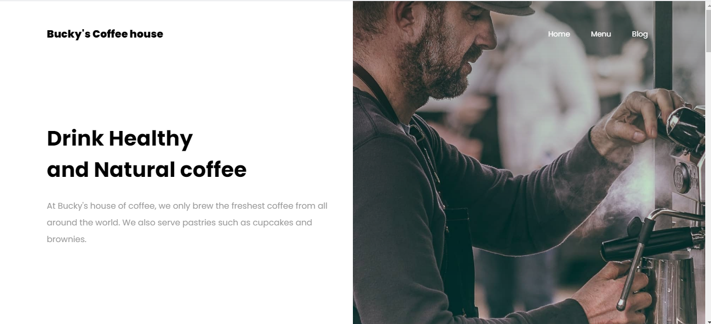
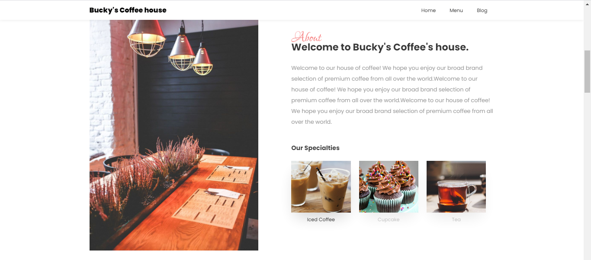
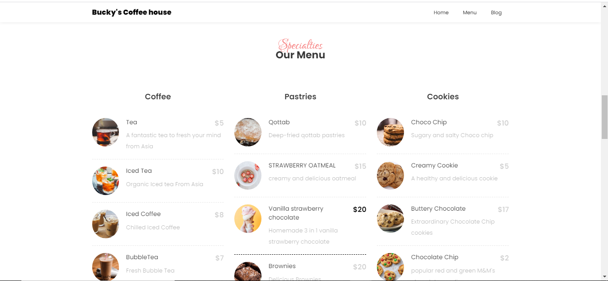
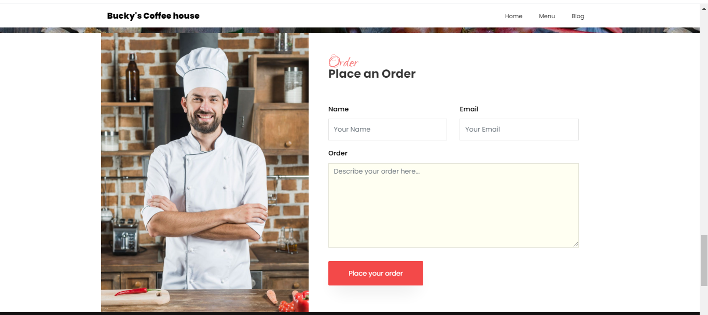
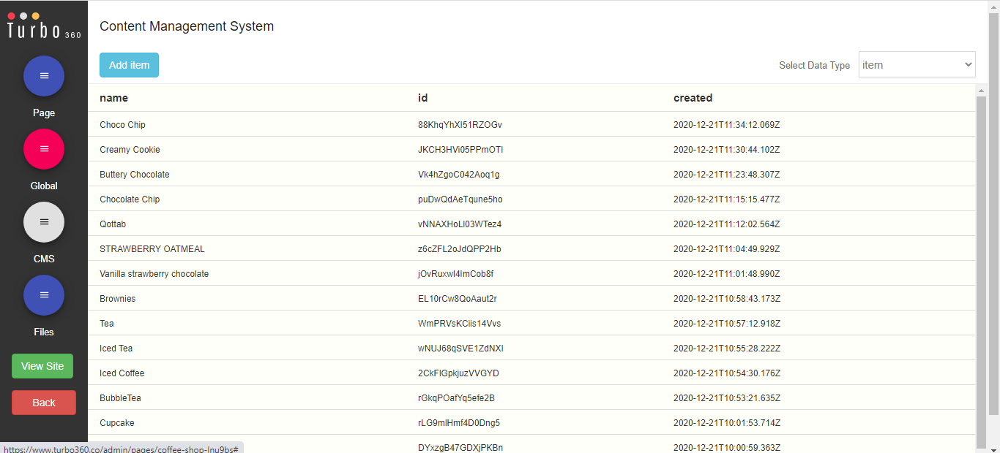

# coffee-shop

This project was built with Turbo 360. To learn more, click here: https://www.turbo360.co


This project is also available. Check the demo here, click here: https://coffee-shop-lnu9bs.turbo360-vertex.com/


# Requirements
***
1. First and foremost, open your terminal and type to clone this repository.
  ```
  git clone https://github.com/HiteshBucky/coffee-shop.git
  ```
2. Install the necessary dependencies to your app by running 
  ```
  npm install
  ```
3. Launch the development build of the app, by running  
  ```
  npm start
  ```
4. Open your favourite browser and type
  ```
  http://localhost:3000/
  ```
Happy Coding :)

## Instructions
After cloning into repo, cd to project root directory and install dependencies:

```
$ npm install
```

To run dev server, install Turbo CLI globally:

```
$ sudo npm install turbo-cli -g
```

Then run devserver from project root directory:

```
$ turbo devserver
```

To build for production, run build:

```
$ npm run build
```


#
#
#
          



#
#
***
#
#


#
#
***
#
#

#
#
***
#
#
# Place some order here
#
#


#
#
***
#
#
# Admin panel



#
#

